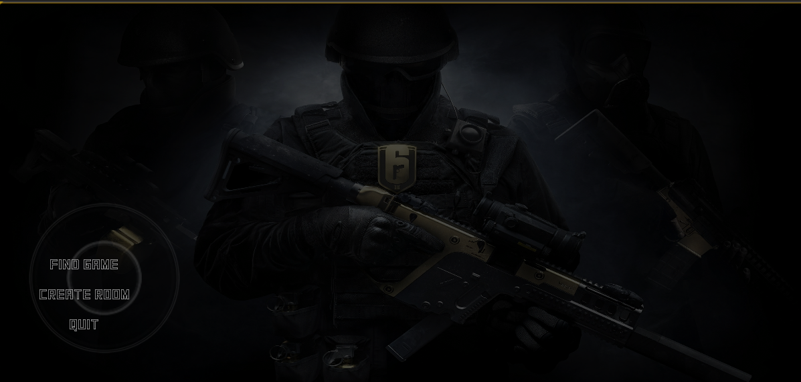
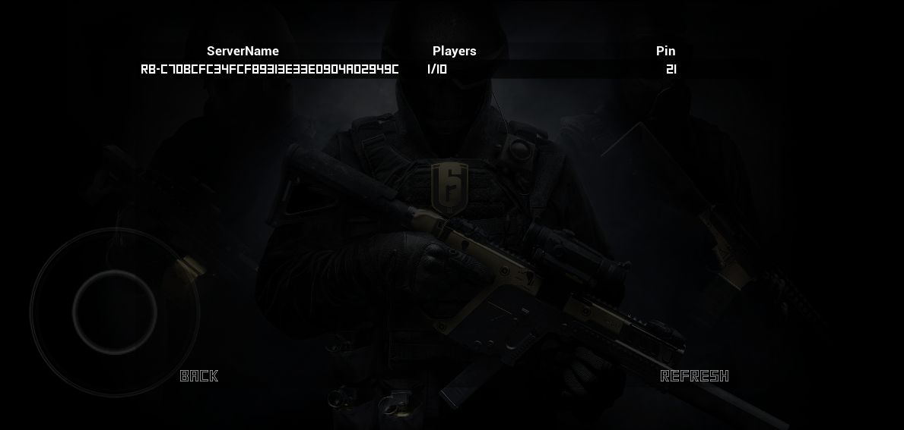
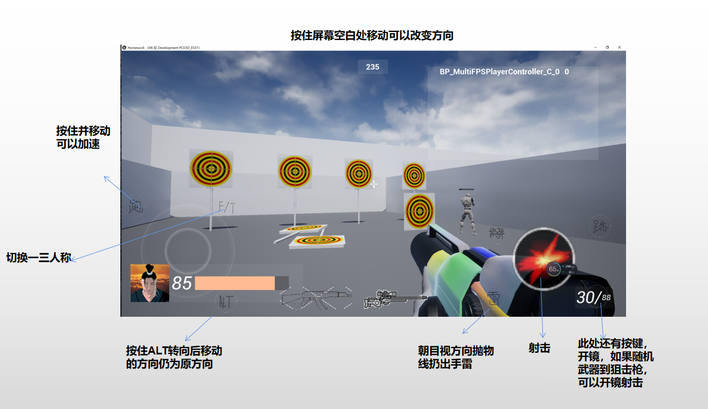

# UE4-FPS
C++开发局域网FPS游戏

安装包为release下 Homework.apk

## 一、游戏介绍

    1、初始进入游戏为MainMenu界面，可选择创建房间或加入游戏

    2、创建房间后会直接进入游戏关卡，加入游戏会打开查找服务器界面

    3、游戏关卡中有小型地图，一个靶场，若干static mesh，随时间会随机位置生成AI
    玩家进入会生成在随机位置，随机生成要求的流光武器或者狙击枪，倒计时结束后退出房间销毁会话，过程中死亡玩家会重生在随机位置

## 二、操作介绍

## san
